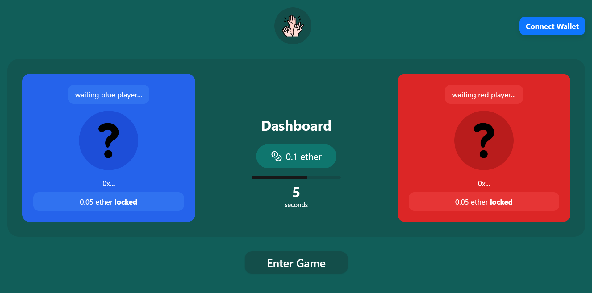
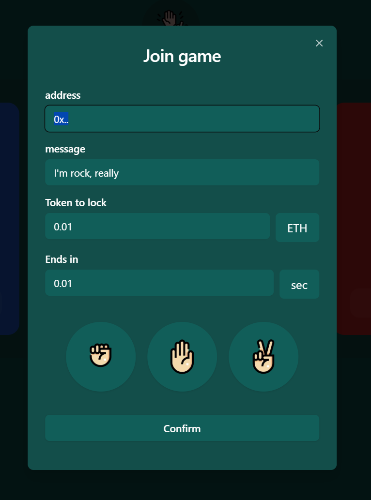
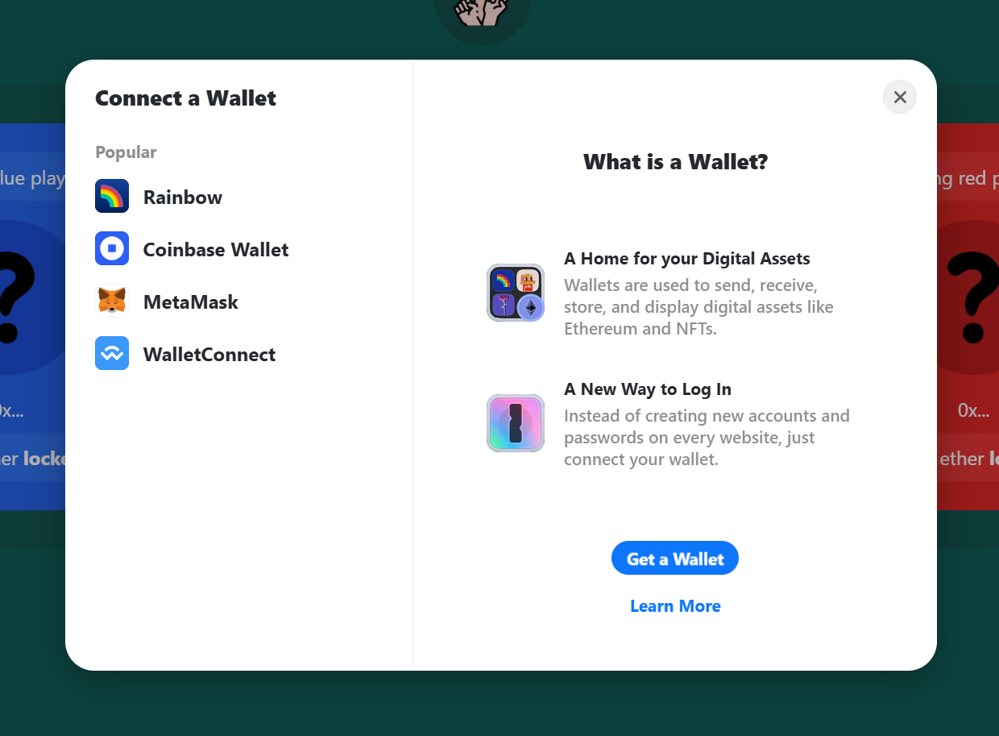

수도권ICT 블록체인 Dapp 만들기 수업을 듣고 만든 미니 프로젝트입니다. (미완성)

# 주제
상대방과 같은 금액의 코인/토큰을 걸고 가위, 바위, 보 중에서 골라서 이긴사람이 모두 가져가기 (수수료 1%)

# 특징
- 승률 리더보드
- 배틀 기록
- 게임 생성 알람

# 구현
- "가위/바위/보 + salt"를 해시한 값을 제출한 뒤, 나중에 증명하는 `commit-reveal` 방식으로 Dapp을 구성
- 컨트랙트와 계정을 foundry로 미리 테스트넷에 배포해서 테스트
- 사용기술: javascript, solidity, foundry, next.js, wagmi, viem, ethers

# 코드 설계
> [코드 폴더](https://github.com/worldbiomusic/gababo/tree/main/foundry/src)
아래는 코드를 만들기 전 구조를 미리 설계한 코드입니다.

**fields**  
- struct Player (
    - address address public
    - string message public: 수정가능
    - bytes hand public: keccak(hand + "_" + salt) (hash("ROCK"+"1234"))
    - string key public: playerRedHand를 밝혀낼 hand + "_" + salt
    - Hand revealedHand public
)
- Player playerRed public
- Player playerBlue public
- uint256 bet public
- uint256 winnerPrize // 우승상금
- uint256 starttime public // block.timestamp
- uint256 playtime public
- Phase phase public

<!--constants -->
- uint256 PLATFORM_FEE constant public: 게임 진행 수수료 rate (1%)
- address PLATFORM_WALLET constant public payable: PLATFORM_FEE 받는 지갑
- uint256 MIN_PLAYTIME constant public: 최소 게임 진행시간 (5분 = (5 * 60) / 12) (블럭 개수로 해야함)
- uint256 MAX_PLAYTIME constant public: 최대 게임 진행시간 (60분 = (60 * 60) / 12 ) (블럭 개수로 해야함)
- uint256 REVEAL_DEADLINE constant public: 게임 결과 검증 시간 (10분) = (10 * 60) / 12 (블럭개수)
- enum Hand(SCISSORS, ROCK, PAPER)
- enum Phase(WAITING, PLAYING, FINISHED)

**functions**  
#### init() private
- playerRed, playerBlue, bet, playtime, winnerPrize, starttime 초기화
- setPhase(Phase.WAITING)
- emit GameInited()

#### join() payable public
msg.sender, fee, hand, message 처리

- 중복참가/2명 초과 이상(error PlayerFulled()) 불가
- 비어있는 player 가져오기
- 처음 입장하는 player이면 gamePlaytime 경계선검사 후 playtime(경계선 잘못되면 WrongPlaytime(uint256 duration))과 bet 설정/blue이면 bet 동일한지 확인 (크거나 적으면 wrongBet(address player, int256 fee))
- player객체 만들고(address, hand, message), red or blue 비어있는곳에 address 할당 (꽉 찼으면 PlayerFulled error 반환)
- 모든 작업이 끝나고, player가 모두 참가하면 -> setPhase(Phase.WAITING)
- emit PlayerJoined(address player, uint256 fee)

#### leave() public onlyPlayers
> 일단 기능 넣지 말기
- phase == waiting 검사 (게임 시작했을 때 불가능, 1명만 참가했으면 가능)
- 1명 player가 msg.sender인지 확인
- init() 호출 (반환 주소는 변수 저장)
- 반환 주소로 bet transfer()

#### selectHand(bytes hand) public onlyPlayers
> 일단 기능 넣지 말기
- phase == waiting || playing 검사
- getPlayer(msg.sender)로 player가져오기 (아니면 종료)
- player의 hand 변경
- emit HandChanged(address player)

#### setMessage(string msg) public onlyPlayers
> 일단 기능 넣지 말기
- phase == waiting || playing 검사
- getPlayer(msg.sender)로 player가져오기 (아니면 종료)
- player의 message 변경
- emit MessageChanged(string message)

#### changeBet(uint256 bet) public payable
> 일단 기능 넣지 말기
- phase == waiting 검사 (시작하면 못 바꿈)
- getPlayer(msg.sender)로 player가져오기 (아니면 종료)
- bet 변경
- emit betChanged(uint256 fee)

#### revealHand(Hand hand, bytes key) public onlyPlayers
> 비밀키 제출해서 승자 선택 후 상금 배분
- phase =? finished
- revealed hand가 Hand중에 없다면 에러 WrongRevealKey() 후 종료
- 밝혀진 hand를 revealedHand로 설정하기
- payPlatformFee() 호출
- 2명이 다 하면 init() 먼저 하고(emit GameFinished(address winner): 2명 다 revealHand() 했을 때), winner()에게 상금/2 전송
- emit HandRevealed(address player, Hand hand)

#### finish() public
> 게임 종료
- playtime 지났는지 검사
- phase =? playing
- setPhaes(Finished)

#### modifier onlyPlayers(address player)
- player가 참가한 players 중 하나인지 검사

#### payPlatformFee()
- winnerPrize * 0.01만큼 PLATFORM_WALLET 에게 전송

#### getPlayer(address player) private returns (Player)
- player param과 같은 player 변수 반환
- 없으면 0x0000...

#### setPhase(Phase phase) public
생략

#### getPhase() public returns (Phase)
생략

#### winner() public pure
- 2명의 revealedHand 계산해서 winner 가져오기
- Hand 비교 winner return (Hand null이면 반대 승자, 둘다 null이면 둘에게 다시 되돌려주기)

**events**  
- GameInited()
- PlayerJoined(address player, uint256 fee)
- betChanged(uint256 fee)
- HandChanged(address player)
- MessageChanged(string message)
- HandRevealed(address player, Hand hand)
- GameFinished(address winner): 2명 다 revealHand() 했을 때

**erros**  
- wrongBet(address player, int256 fee)
- WrongPlaytime(uint256 duration)
- WrongRevealKey()
- PlayerFulled()

**예외사항**  
- HAND가 enum 중에 없을 경우 패배
- playtime 이전에 reveal() 안할경우 패배 (init()에서)
- reveal할 때 잘못된 salt 제출시(hash가 맞지 않을 때)
- 게임 시작전 나가기
- safemath 사용하기

## 흐름
1. Battle 만들기: 제한시간과 참가비 설정
2. 생성된 컨트랙트를 웹에서 리스트에 보여줌
3. 상대편 참가: 참가비 지출, 입장 신호
4. 각각 가위/바위/보 중 선택해서 제출
5. 시간이 다 되면 참가자가 보낸 문자열 복호화 소스를 제공해서 결과 오픈 (만약 지정시간까지 결과 도출안하면 패배)

## 라이브러리
- tailwinds (dialog는 headless ui 사용)
- [progressbar](https://github.com/vydimitrov/react-countdown-circle-timer)
- [frame motion](https://www.framer.com/motion): 에니메이션 관련 (버튼 누를 때 뾰옹~)
## icon
- `<a href="https://www.flaticon.com/free-icons/coin" title="coin icons">Coin icons created by kliwir art - Flaticon</a>`
- [돈](https://www.flaticon.com/kr/free-icon/money-bag_2953423?term=%EB%8F%88&page=1&position=3&origin=search&related_id=2953423)